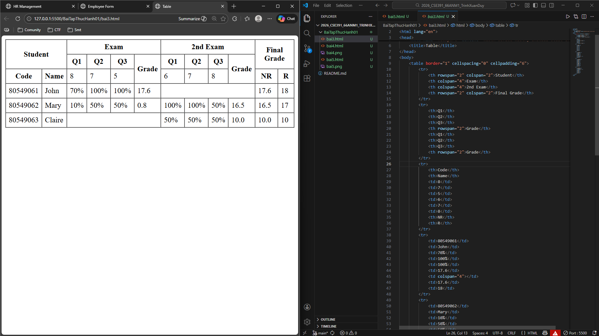
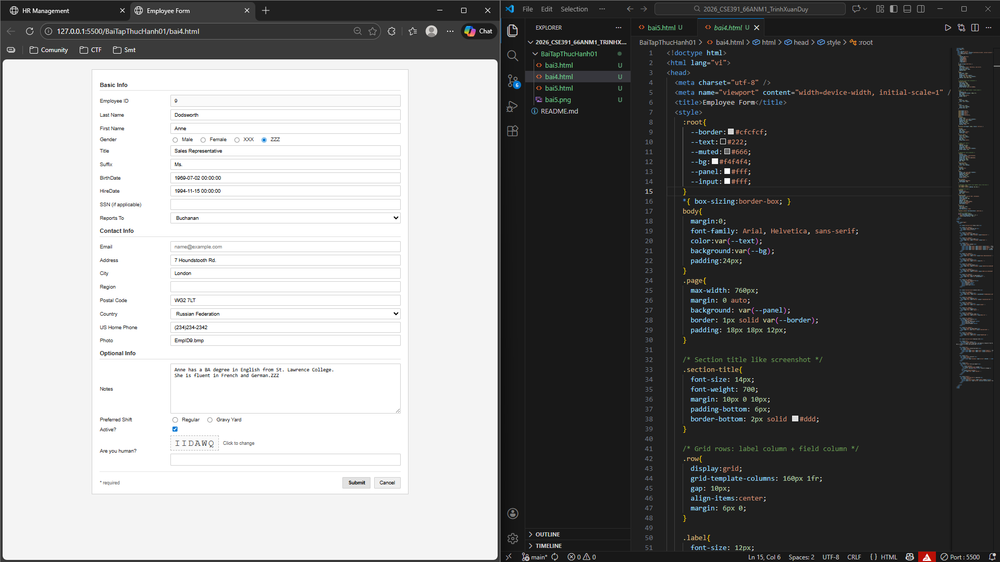
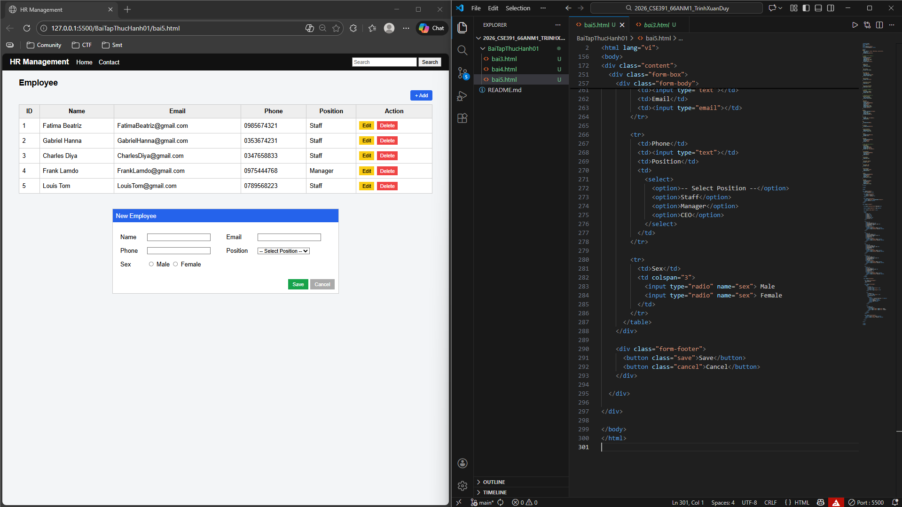

# 🧪 Bài thực hành 1 – Nền tảng phát triển web

---

## 📋 Bài 3 – Bảng dữ liệu cơ bản

Bài này tập trung vào việc xây dựng bảng HTML cơ bản, sử dụng các thẻ:

- `table`
- `tr`, `th`, `td`
- `rowspan`, `colspan`

Mục tiêu là làm quen với cách trình bày dữ liệu dạng bảng trong trang web.

### 🖼️ Minh chứng

---

## 📝 Bài 4 – Form cơ bản

Bài này yêu cầu tạo form HTML đơn giản để nhập dữ liệu người dùng, bao gồm:

- Ô nhập văn bản
- Email
- Radio button
- Select option
- Button

Mục tiêu là hiểu cấu trúc form.

### 🖼️ Minh chứng

---

## 🖥️ Bài 5 – Giao diện cơ bản

Bài này xây dựng một giao diện web đơn giản, kết hợp bảng và form, có bố cục rõ ràng.

Mục tiêu là làm quen với việc tổ chức layout và trình bày giao diện HTML/CSS cơ bản.

### 🖼️ Minh chứng

